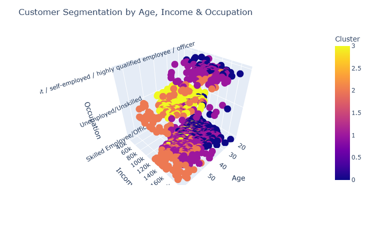

# Customer segmentation analysis using K-Means clustering
<!-- TABLE OF CONTENTS -->

## Table of Contents

- [Overview](#overview)
- [Tools](#tools)
- [Contact](#contact)

<!-- OVERVIEW -->

## Overview

In this project, I built a customer segmentation analysis using K-Means clustering. I used the following steps to build the model:

1. Data Preprocessing: I cleaned the data by removing missing values and outliers.
2. K-Means Clustering: I used the K-Means clustering algorithm to segment the customers into different groups.
3. Cluster Analysis: I analyzed the clusters to identify the characteristics of each group.
4. Customer Segmentation: I used the cluster analysis to segment the customers into different groups based on their characteristics.

The final output of the project is a customer segmentation analysis dashboard using Plotly and Dash. The dashboard allows users to explore the clusters and identify how the customers are segmented based on their characteristics of each group. You can find the app here.

## Tools

- [Pandas](https://pandas.pydata.org)
- [Matplotlib](https://matplotlib.org)
- [Plotly](https://plotly.com/)
- [Seaborn](https://seaborn.pydata.org)
- [Sklearn](https://scikit-learn.org/stable/user_guide.html)

## Contact

- GitHub [@Sotun-1010](https://github.com/Sotun-1010)
- Twitter [@O_G_Sotun](https://twitter.com/O_G_Sotun?t=kRiO1YNhYKn8NJJnxTZ42A&s=03)
- Portfolio Site [Ogunjirin Oluwasotun](https://www.datascienceportfol.io/oluwasotunogunjirind)
- Medium [Ogunjirin Oluwasotun Goodness](https://medium.com/@oluwasotunogunjirin)
- Website [Oglytics](https://oglytics.webflow.io/)
